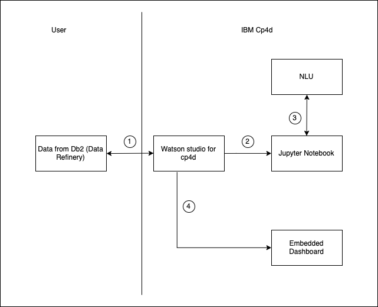

# Short Title

Analyse Customer Sentiment on Seller Quality with Natural Language Understanding

# Long Title

# Author
* [Manoj Jahgirdar](https://www.linkedin.com/in/manoj-jahgirdar-6b5b33142/)
* [Smruthi Raj Mohan](https://www.linkedin.com/in/smruthi-raj-mohan-143088145/)
* [Srikanth Manne]()
* [Manjula Hosurmath](https://www.linkedin.com/in/manjula-g-hosurmath-0b47031)

# URLs

### Github repo

* https://github.com/IBM/customer-sentiment-on-seller-quality-nlu-cp4d/

### Deploy on Cloud Pak for Data

* https://github.com/IBM/customer-sentiment-on-seller-quality-nlu-cp4d/blob/master/deploy-on-cloud-pak.md

### Deploy on IBM Cloud

* https://github.com/IBM/customer-sentiment-on-seller-quality-nlu-cp4d/blob/master/deploy-on-cloud.md

# Summary

In this code pattern, we will analyse sellers quality by understanding the sentiments and emotions of reviews given by customers to the sellers using Watson Natural Language Understanding on Cloud Pak for Data or IBM Cloud and give a more impactful seller rating to the sellers.

# Technologies

* [Analytics](https://developer.ibm.com/technologies/analytics/): Uncover insights with data collection, organization, and analysis.
* [Machine learning](https://developer.ibm.com/technologies/machine-learning/): Teach systems to learn without them being explicitly programmed.
* [Natural Language Understanding](https://developer.ibm.com/technologies/natural-language-processing/): Build apps that can interpret unstructured data and analyze insights.
* [Python](https://developer.ibm.com/technologies/python): An open-source interpreted high-level programming language for general-purpose programming.

# Description

The rating which is given to a seller on e-commerce platform is just a rating given explicitly by the customers and does not make more impact to the sellers quality. We are adding more parameters to this rating to make it stronger and more impactful. We read the product reviews of a seller and analyse the sentiment and emotion behind the review with Watson Natural Language Understanding and compute a score, we also analyse the delivery status of the product and whether the product is delivered on or before the estimated date of delivery and compute another score, finally we sum up these scores to get a seller quality rating between 0 to 5 stars which makes more impact to the seller ratings.

# Flow

<!--add an image in this path-->

<!--Optionally, add flow steps based on the architecture diagram-->

1. Create a connection for the refined data in db2 into IBM Watson Studio project in Cloud Pak for Data or IBM Cloud.

2. Setup Jupyter Notebook that reads the dataset from the IBM db2 Connection.

3. Run the Algorithm from Jupyter notebook that computes the seller rating with the help of Watson Natural Language Understanding on Cloud Pak for Data or IBM Cloud.

4. Visualise insights from the data using Watson Embedded Dashboard on Cloud Pak for Data or IBM Cloud.

# Instructions

The Code Pattern can be deployed on either Cloud Pak for Data or IBM Cloud. Please follow the respective Instructions to deploy.

### Instructions to deploy on Cloud Pak for Data: 
> Find the detailed steps in the [Deploy on Cloud Pak for Data](https://github.com/IBM/customer-sentiment-on-seller-quality-nlu-cp4d/blob/master/deploy-on-cloud-pak.md) file.

1. Download the Dataset

2. Create Watson Natural Language Understanding Service

3. Create a Project **(Already completed as a part of the Tutorial)**

4. Add Db2 Connection to the Project **(Already completed as a part of the Tutorial)**

5. Prepare and Run the Jupyter Notebook

6. Add Embedded Dashboard to the Project

7. Visualize the Dashboard

### Instructions to deploy on IBM Cloud:
> Find the detailed steps in the [Deploy on IBM Cloud](https://github.com/IBM/customer-sentiment-on-seller-quality-nlu-cp4d/blob/master/deploy-on-cloud.md) file.

1. Download the Dataset

2. Create Watson Natural Language Understanding Service

3. Create Watson Studio Service **(Already completed as a part of the Tutorial)**

4. Add Db2 Connection to the Project **(Already completed as a part of the Tutorial)**

5. Prepare and Run the Jupyter Notebook

6. Create Embedded Dashboard Service

7. Visualize the Dashboard

# Components and services

* [IBM Natural Language Understanding](https://cloud.ibm.com/catalog/services/natural-language-understanding): Use advanced NLP to analyze text and extract meta-data from content such as concepts, entities, keywords, categories, sentiment, emotion, relations, and semantic roles.

* [IBM Watson Studio](https://cloud.ibm.com/catalog/services/watson-studio): Watson Studio democratizes machine learning and deep learning to accelerate infusion of AI in your business to drive innovation. Watson Studio provides a suite of tools and a collaborative environment for data scientists, developers and domain experts.

* [IBM Machine Learning](https://cloud.ibm.com/catalog/services/machine-learning): IBM Watson Machine Learning is a full-service IBM Cloud offering that makes it easy for developers and data scientists to work together to integrate predictive capabilities with their applications.
